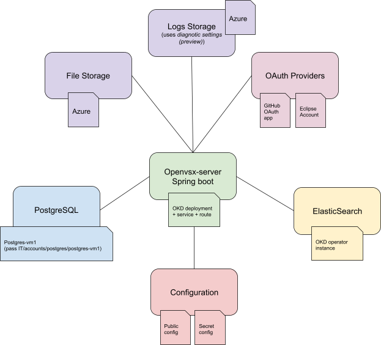

# Implementation Overview
## https://github.com/eclipse/openvsx
Core implementation
- Java/Spring server app
- Postgres DB
- ElasticSearch
- Blob storage (Azure or Google Cloud)
- React/TypeScript Web UI

## https://github.com/EclipseFdn/open-vsx.org
Deployment specific detail for open-vsx.org deployment
- [`application.yml`](https://github.com/EclipseFdn/open-vsx.org/blob/main/configuration/application.yml)
- Eclipse Foundation specific UI
- Publisher’s agreement

## https://github.com/open-vsx/publish-extensions
Scripts and Github actions for publishing 
- [`extensions.json`](https://github.com/open-vsx/publish-extensions/blob/master/extensions.json) file for list of extensions to auto-publish
- Github action for nightly auto-publishing
- [log](https://github.com/open-vsx/publish-extensions/actions/runs/6414215619) of results
- Github action for publishing a specific extension

# Publishing an Extension
- One must first have signed the [Publisher Agreement](https://open-vsx.org/publisher-agreement-v1.0). 
- Publisher agreement status visible in your [profile](https://open-vsx.org/user-settings/profile).
## Packaging
- Create a `.vsix` file with the `ovsx package` command
- Minimal package includes `extension.js` and `package.json`
## Publishing
- Click ['Publish'](https://open-vsx.org/user-settings/extensions) and drag and drop `.vsix` file in the UI.
- Use the `ovsx publish --p [personal access token]` command. Requires a personal access token one generates from [profile settings](https://open-vsx.org/user-settings/tokens).
- Because file processing is asynchronous, extension will temporarily show as inactive until file processing completes, assuming no errors.

# Deployment
## Basic implementation architecture
[Documentation](https://github.com/eclipse/openvsx/wiki/Deploying-Open-VSX) on architecture of implementation and instructions for building and deploying.
### Database tables
#### Core Extension Information
```
user_data
extension
extension_review
extension_version
file_resource
namespace
namespace_membership
namespace_social_links
personal_access_token
```

### Recurring Jobs
- update-download-counts
- MonthlyAdminStatistics
- ElasticSearchUpdateIndex 
- DataMirror, if mirror mode is enabled
### Background processes
- File processing on publish
- Namespace rename/merge
- DB migration
- Extension file removal
- Generate/delete keypair for extension signing
- Create/delete extension signature
## Open-vsx.org Specifics

### Service Details
- Kubernetes Cluster - Ask Eclipse IT Team
- Spring Boot `v3.1.0`
- Java version `eclipse-temurin:17.0.7_7-jdk`
- Postgres version and capacity - Ask Eclipse IT Team
- Elastic version and capacity - `v8.7.1`, 3 pods
- Azure Blob storage
### Monitoring and Alerting
- Better Uptime
- Thresholds

# Deployment Process
1. `@amvanbaren` creates a pull request in the `eclipse/openvsx` repository.
2. GitHub runs Eclipse Contributor Agreement action to check that the committer has signed the Eclipse Contributor Agreement.
3. GitHub action runs unit tests and integration tests.
4. `@amvanbaren` merges the pull request into the `eclipse/openvsx` `master` branch.
5. `@amvanbaren` creates new [release](https://github.com/eclipse/openvsx/releases) in the `eclipse/openvsx` repository:
    1. `@amvanbaren` merges `@dependabot` pull requests to fix vulnerabilities.
    2. `@amvanbaren` drafts a new release and publishes it.
    3. GitHub action creates server and webui Docker images.
    4. if `webui` has changed, then `@amvanbaren` publishes new `openvsx-webui` version to NPM.
    5. if `cli` has changed, then `@amvanbaren` publishes new `ovsx` version to NPM.
    6. `@amvanbaren` updates release post with links to `server` and `webui` Docker images and, if changed, `openvsx-webui` and `ovsx` NPM packages.
6. `@amvanbaren` updates `DockerFile` in `amvanbaren/open-vsx.org` repository with new `openvsx-server` Docker image version and, if changed, new `openvsx-webui` package version.
7. if `openvsx-webui` version has changed, then `@amvanbaren` updates the `openvsx-webui` version in the `website/package.json` file and runs `yarn install` to update the `yarn.lock` file.
8. `@amvanbaren` commits and pushes the changes to a new branch in the `amvanbaren/open-vsx.org` repository.
9. `@amvanbaren` creates pull request to merge the new `amvanbaren/open-vsx.org` branch into `EclipseFdn/open-vsx.org` repository `main` branch.
10. GitHub runs Eclipse Contributor Agreement action to check that the committer has signed the Eclipse Contributor Agreement.
11. GitHub action kicks off Jenkins job to verify the new Docker image.
12. `@amvanbaren` merges the pull request into the `main` branch.
13. GitHub action kicks off Jenkins job to build the Docker image and deploy it to `staging`.
14. `@amvanbaren` checks the staging server and does some quick smoke testing.
15. `@amvanbaren` creates pull request in `EclipseFdn/open-vsx.org` repository to merge the `main` branch into the `production` branch.
16. `@kineticsquid` or `@eclipsewebmaster` review and approve the pull request.
17. `@amvanbaren` merges the pull request into the `production` branch.
18. GitHub action kicks off Jenkins job to build the Docker image and deploy it to `production`.
19. `@amvanbaren` monitors production for ~15 min to make sure the deployment succeeded and the server is stable.

# Common Error Situations and Remedies
1. ElasticSearch unresponsive:
      1. Delete ElasticSearch pods.
      2. In server application.yml set `ovsx.elasticsearch.clear-on-start: true`.
      3. Wait until all ElasticSearch pods have started.
      4. Deploy server application.
      5. In server application.yml remove `ovsx.elasticsearch.clear-on-start: true`.
2. Open VSX server unresponsive:
      1. Delete Open VSX server pod.
      2. Wait until new pod has started.
      3. Repeat the previous steps until all Open VSX server pods are renewed.
3. Too much load:
      1. Delete pod that is under load.
      2. Wait until new pod has started.

# Administration
- Administration requests appear as [issues](https://github.com/EclipseFdn/open-vsx.org/issues).
## Namespace ownership
- Ensure there is no a compelling reason a person should not be granted ownership.
    - A random person requesting ownership of 'redhat' namespace.
    - There is no current owner.
    - There are no other contributors ('Openvsx', auto-publishing ID, is a special case)
- If the namespace doesn't exist, create it.
- Assign the user (by Github ID) as owner, by adding or by changing status from 'Contributor' to 'Owner'.
- If extensions are being auto-published, alert the new owner
## Un-publishing extension versions
- This is a slow process.
- If un-publishing a larger number of versions, authentication will time out. Keep a second browser tab open to continually refresh.
## Renaming/merging namespaces
- Background process that can take some time (exponential backoff/retry)
## Questions about licenses and potentially malicious extensions
- Consult Visual Studio file
- Check with Wayne
## Merging Auto-publish PRs
- Committers on https://github.com/open-vsx/publish-extensions do this.


